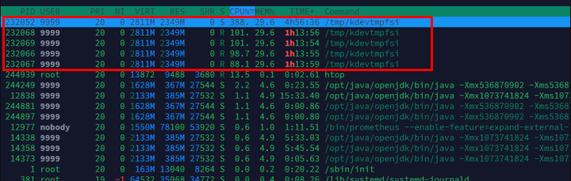
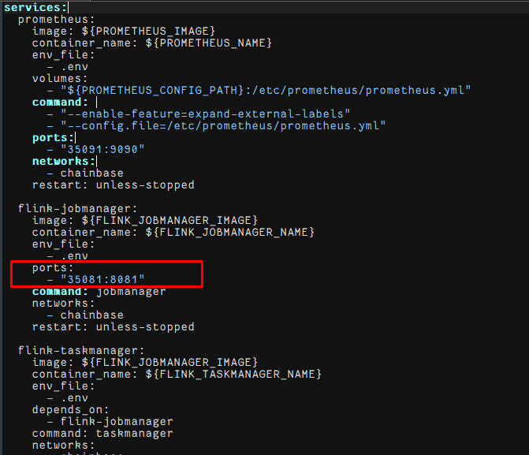

Some users got this malware in their servers

It was because a vulnerability in port 8081
To avoid:
1- Delete 2 lines in docker-compose.yml

cd $HOME/chainbase-avs-setup/holesky

vi docker-compose.yml

# delete 2 lines in the pic
2- Restart docker
docker compose up -d