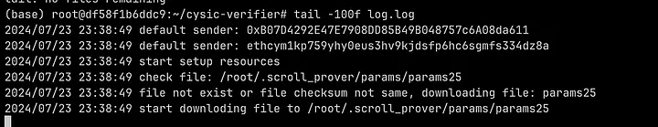
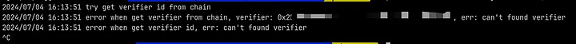
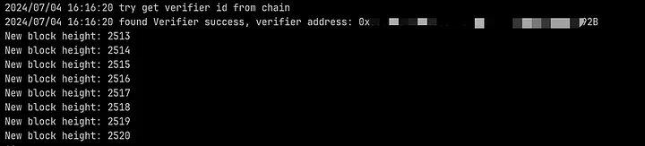
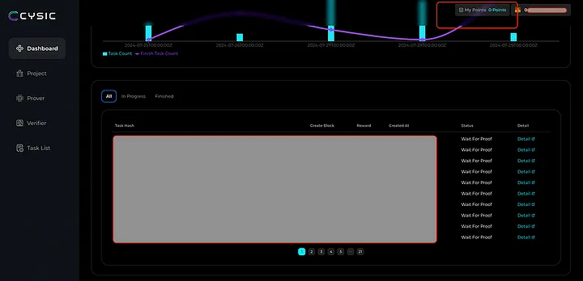

## Requirements:
Ensure your device meets the following minimal specs for a smooth Cysic verifier program installation:

- CPU: Single Core
- Memory: 512 MB
- Disk: 10 GB
- Bandwidth: 100 KB/s upload/download
- Available OS: Linux, Windows, Mac

## Operating the Verifier Node Program
If the backend confirms your address, please follow the steps to download the verification program. The program size is about 4GB, please be patient in downloading.
## Linux

```
rm -rf ~/cysic-verifier
cd ~
mkdir cysic-verifier
curl -L https://cysic-verifiers.oss-accelerate.aliyuncs.com/verifier_linux > ~/cysic-verifier/verifier
curl -L https://cysic-verifiers.oss-accelerate.aliyuncs.com/libzkp.so > ~/cysic-verifier/libzkp.so

```
## Macos
```
rm -rf ~/cysic-verifier
cd ~
mkdir cysic-verifier
curl -L https://cysic-verifiers.oss-accelerate.aliyuncs.com/verifier_mac > ~/cysic-verifier/verifier
curl -L https://cysic-verifiers.oss-accelerate.aliyuncs.com/libzkp.dylib > ~/cysic-verifier/libzkp.dylib
```

## Execute the command to set the configuration file information.

❗𝗡𝗼𝘁𝗲 𝘁𝗵𝗮𝘁 𝘁𝗵𝗲 𝗰𝗼𝗻𝘁𝗲𝗻𝘁 𝗼𝗳 𝘁𝗵𝗲 𝗶𝘁𝗲𝗺 𝗶𝗻 𝗹𝗶𝗻𝗲 𝟭𝟯 𝘀𝗵𝗼𝘂𝗹𝗱 𝗯𝗲 𝘆𝗼𝘂𝗿 𝗮𝗱𝗱𝗿𝗲𝘀𝘀 𝘀𝘂𝗯𝗺𝗶𝘁𝘁𝗲𝗱 𝘁𝗼 𝘁𝗵𝗲 𝘃𝗲𝗿𝗶𝗳𝗶𝗲𝗿!!!

## Linux and Mac:
```
cat <<EOF > cysic-verifier/config.yaml
# Not Change
chain:
  # Not Change
  endpoint: "testnet-node-1.prover.xyz:9090"
  # Not Change
  chain_id: "cysicmint_9000-1"
  # Not Change
  gas_coin: "cysic"
  # Not Change
  gas_price: 10
  # Modify Here： ! Your Address (EVM) submitted to claim rewards
claim_reward_address: "0x696969696969"

server:
  # don't modify this
  cysic_endpoint: "https://api-testnet.prover.xyz"
EOF
```

## Execute the verifier program:
## Linux
```
cd ~/cysic-verifier/
chmod +x ~/cysic-verifier/verifier
echo "LD_LIBRARY_PATH=.:~/miniconda3/lib:$LD_LIBRARY_PATH export CHAIN_ID=534352 ./verifier" > ~/cysic-verifier/start.sh
chmod +x ~/cysic-verifier/start.sh
~/cysic-verifier/start.sh
```
## Macos
```
cd ~/cysic-verifier/
chmod +x ~/cysic-verifier/verifier
echo 'DYLD_LIBRARY_PATH=".:~/miniconda3/lib:$DYLD_LIBRARY_PATH" CHAIN_ID=534352 ./verifier' > ~/cysic-verifier/start.sh
chmod +x ~/cysic-verifier/start.sh
~/cysic-verifier/start.sh
```

## Please check whether the address in the log is consistent with the Address item in the form.

## If it is the first time to start, the verifier dependency file will be automatically downloaded, please wait 15–20 mins:


## If you do not pass the application, the error occurs, and the program will be rechecked:


## If your address is connected, the verifier can be successfully deployed:


```
❗Warning: Do not turn off your terminal, it will afffect your ZK task verification and points
```

## Check your points and verification status at :

https://testnet.cysic.xyz/m/dashboard/



