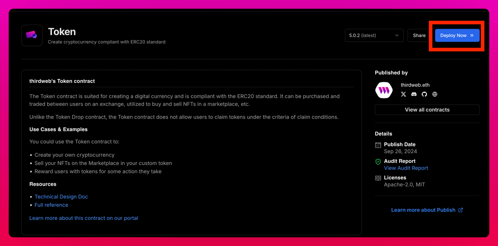

## Uniswap just dropped Unichain, and this brings a new airdrop opportunity

## The first $UNI airdrop was huge, but there's still 45% left to be distributed

## This means we should definitely keep our eyes on Unichain:

- Bridge to Unichain
- Deploy a token
- Run a Node


## 1. Bridge ETH to Unichain and Make some swaps on Testnet

▸ Get some ETH on Sepolia
✦ Sepolia Faucets: https://docs.scroll.io/en/user-guide/faucet/

▸ Bridge ETH from Sepolia to Unichain: https://superbridge.app/unichain-sepolia

▸ Make some swaps on Uniswap (Testnet mode): https://app.uniswap.org


## 2. Deploy an ERC20 token on Unichain

• You can easily do a one-click deployment with 
@Owlto_Finance
: https://owlto.finance/deploy?chain=Unichain




• Or, you can use @thirdweb


▸ Go to https://thirdweb.com, connect your wallet, and sign up
▸ Go to the "Contracts" tab and hit "Deploy"
▸ Click "Ready to Deploy" and choose one (I picked token)
▸ After setting the name, ticker, and other stuff, just deploy it

📌You can also deploy ERC721 or other types. Just select the other options after clicking "Ready to Deploy

## 3. Being a $SUI staker sets you apart from the others

It's been made clear: to become a validator on Unichain, stake $SUI on Ethereum mainnet

If you're aiming to benefit from a potential airdrop, I think this step is key


## 4. Run a Node (Optional)

Not guaranteed rewards

📌 Rent a VPS

▸ Go to https://contabo.com/en/vps/ sign up, and rent the second VPS (CLOUD VPS 2)

▸ I will run it for a few months so I bought it monthly, there will be a one time set-up fee

Select:
-European Union
-400 GB SSD
-Ubuntu 22.04
-Set your password and note it

▸ Do not change any other settings and complete the purchase

▸ Your node information will be sent to you via e-mail shortly

You don't have to use Contabo. You can rent VPS from another platform. If there is a cheaper one, write it in the comments

## 5. Go to https://github.com/Luthenn/Unichain-Node and paste the commands into your VPS one by one to run the node

At step 7, just copy the RPC links I mentioned and replace them. That’s all you need to do there.


## Update Sudo
```
sudo apt update && sudo apt upgrade -y
```
## Install Docker
```
sudo apt install docker.io
```
## Install Docker Compose
```
sudo curl -L "https://github.com/docker/compose/releases/download/v2.20.2/docker-compose-$(uname -s)-$(uname -m)" -o /usr/local/bin/docker-compose
sudo chmod +x /usr/local/bin/docker-compose
```
## Clone the Unichain Repository
```
git clone https://github.com/Uniswap/unichain-node
```
## Unichain Directory
```
cd unichain-node
```
## Open .env.sepolia file
```
nano .env.sepolia
```
## Edit OP_NODE_L1_ETH_RPC and OP_NODE_L1_BEACON
```
OP_NODE_L1_ETH_RPC to: https://ethereum-sepolia-rpc.publicnode.com

OP_NODE_L1_BEACON to: https://ethereum-sepolia-beacon-api.publicnode.com
```


### Run the Node
```
docker-compose up -d
```
## Curl
```
curl -d '{"id":1,"jsonrpc":"2.0","method":"eth_getBlockByNumber","params":["latest",false]}' \
  -H "Content-Type: application/json" http://localhost:8545
  
```
## Done!
